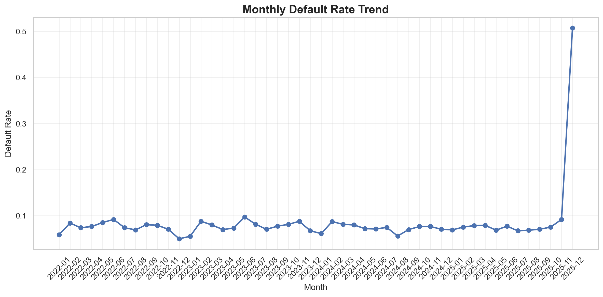
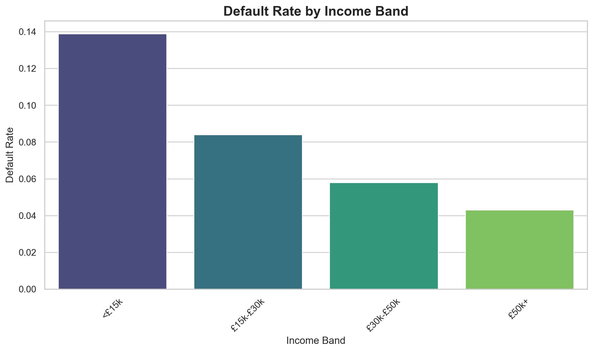

# Portfolio Collections Dashboard

**Goal:** Visualise arrears and default trends to support proactive collections management for a water utility company. This interactive dashboard reuses the same dataset as the Predicting Customer Payment Default Risk project to create actionable business insights.

## Data Sources
- `data/customers.csv` - Customer demographics and account details (1,500 customers)
- `data/bills.csv` - Monthly billing records with usage (72,000 bills)
- `data/payments.csv` - Payment transaction history (64,738 payments)
- `data/collections_actions.csv` - Collections activity tracking (15,418 actions)
- `data/water_collections_demo.sqlite` - Optimised analytical database

## What's Inside
- **🎛️ Interactive Notebook**: [`notebooks/Portfolio_Collections_Dashboard.ipynb`](notebooks/Portfolio_Collections_Dashboard.ipynb)
  - **Working Interactive Dashboard** with functional widgets and real-time updates
  - **Comprehensive Data Tables** displaying all analysis results
  - **Enhanced Interactive Charts** with hover details, zoom, and pan functionality
  - **Multiple Dashboard Types** for different analysis needs
- **📊 Static Documentation Charts** saved to `outputs/figures/` for this README
- **📋 Complete Analysis** with actionable insights and recommendations

## Interactive Dashboard Features

### 🎛️ **Widget-Based Dashboard (Section 5)**
- **📅 Date Range Filtering**: Start/end date dropdowns for time period selection
- **📊 Metric Switching**: Toggle between Default Rate, Billed Amount, Paid Amount
- **🎯 Segmentation Analysis**: Switch between Income Band, Region, and Tariff views
- **⚡ Real-time Updates**: Charts and summary statistics update instantly
- **📋 Dynamic Data Tables**: Filtered datasets displayed with each selection

### 📈 **Enhanced Interactive Charts (Section 6)**
- **Monthly Trend Analysis**: Interactive line charts with hover details and zoom
- **Income Band Segmentation**: Colour-coded bar charts with detailed tooltips
- **Regional Performance**: Geographic analysis with rotated labels for readability
- **Collections Actions**: Interactive pie charts with percentage breakdowns
- **Correlation Analysis**: Scatter plots showing bill amount vs default rate relationships

### 📊 **Comprehensive Data Tables**
- **Source Data Samples**: First 3 rows from each database table
- **Complete Monthly Dataset**: All 48 months of KPI data displayed
- **Segmentation Analysis**: Income, region, tariff, and vulnerability breakdowns
- **Collections Metrics**: Action types, volumes, and effectiveness percentages
- **Enhanced Statistics**: Customer counts, averages, and trend analysis

## Screenshots
### Monthly Default Rate


### Default by Income Band


### Default by Region


### Collections Actions Distribution


## How to Run the Interactive Dashboard

### Prerequisites
```bash
pip install -r requirements.txt
python -c "import sqlite3, pandas as pd, plotly, ipywidgets; print('All dependencies OK')"
```

### Launch Interactive Dashboard
```bash
# Launch Jupyter notebook (recommended for full interactivity)
jupyter notebook notebooks/Portfolio_Collections_Dashboard.ipynb

# Alternative: VS Code with Jupyter extension
# Open the .ipynb file and run all cells
```

### Using the Dashboard
1. **Run All Cells** in the notebook to load data and create interactive components
2. **Use Widget Controls** to filter and explore data:
   - Select date ranges from dropdown menus
   - Switch between different metrics (default rate, amounts)
   - Toggle segmentation views (income, region, tariff)
3. **Interact with Charts**:
   - Hover over data points for detailed information
   - Zoom in/out using mouse wheel or controls
   - Pan across charts by clicking and dragging
   - Double-click to reset zoom levels

## Key Insights & Analytics

### 📊 **Portfolio Performance**
- **Overall Default Rate**: 8.4% across the portfolio
- **Highest Risk Segment**: <£15k income band (13.9% default rate)
- **Geographic Risk**: Reading region shows highest default rates (9.3%)
- **Collections Volume**: 15,418 total actions tracked

### 🎯 **Segmentation Analysis**
- **Income-Based Risk**: Clear correlation between income level and default rates
- **Regional Variations**: Significant geographic differences in payment behaviour
- **Tariff Impact**: Social tariffs show different default patterns
- **Vulnerability Factor**: Vulnerable customers require specialised handling

### 📞 **Collections Effectiveness**
- **Action Distribution**: Reminder sequences and arrangement patterns
- **Intervention Timing**: D-3 to D+60 payment window analysis
- **Success Metrics**: Payment recovery rates and arrangement effectiveness

## Technical Implementation

### 🛠️ **Technology Stack**
- **Python**: Core analytics and data processing
- **Jupyter Notebook**: Interactive development environment
- **plotly**: Professional interactive visualisations
- **ipywidgets**: Responsive dashboard controls
- **pandas**: Efficient data manipulation and analysis
- **SQLite**: Optimised analytical database with indexes

### 📈 **Data Pipeline**
- **Source**: CSV files with 153,656 total records
- **Processing**: SQLite database with analytical views and indexes
- **Analysis**: KPI calculations with D-3 to D+60 payment windows
- **Visualisation**: Interactive charts with real-time filtering

### 🎯 **Dashboard Architecture**
- **Widget Controls**: Date range selectors, metric dropdowns, segmentation toggles
- **Real-time Processing**: Instant data filtering and chart updates
- **Interactive Charts**: Hover details, zoom, pan, and reset functionality
- **Data Tables**: Comprehensive display of filtered and segmented data

## Project Extensions

### 🚀 **Potential Enhancements**
- **Cohort Analysis**: Track customer payment behaviour over time
- **Predictive Modelling**: Early warning systems for default risk
- **Arrears Balances**: Outstanding amount calculations and tracking
- **ROI Analysis**: Collections action effectiveness and cost-benefit
- **Real-time Integration**: Live data feeds and automated reporting

### 📊 **Business Applications**
- **Risk Management**: Proactive identification of high-risk customers
- **Collections Optimisation**: Data-driven intervention strategies
- **Performance Monitoring**: Regular dashboard updates and KPI tracking
- **Strategic Planning**: Portfolio-level insights for business decisions

## Notes
- **Dataset Reuse**: Leverages the same high-quality dataset as the Payment Default Risk project
- **Portfolio Ready**: Professional presentation suitable for showcasing analytical capabilities
- **Scalable Design**: Architecture supports additional metrics and data sources
- **British Standards**: Maintains UK spelling and regulatory compliance throughout